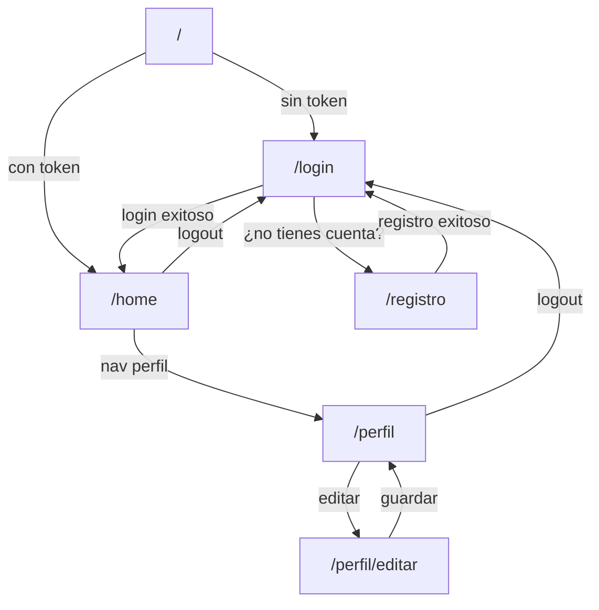

# Diseño Técnico — Colitas Felices Frontend (Iteración 2)

## Visión General

El frontend de Colitas Felices es una aplicación Next.js 16 con App Router, React 19, TypeScript y Tailwind CSS. Implementa cinco vistas principales (registro, login, home, perfil y edición de perfil), un módulo centralizado de cliente HTTP (`API_Client`), un mecanismo de protección de rutas (`Auth_Guard`) basado en `sessionStorage`, y gestión de sesión mediante token.

El backend expone los siguientes endpoints REST:

| Método | Ruta        | Descripción                          | Autenticado |
|--------|-------------|--------------------------------------|-------------|
| POST   | /registro   | Crea un nuevo usuario                | No          |
| POST   | /login      | Autentica y devuelve token           | No          |
| POST   | /logout     | Invalida el token activo             | Sí          |
| GET    | /me         | Devuelve datos del usuario activo    | Sí          |
| PUT    | /usuarios   | Actualiza datos del usuario activo   | Sí          |

---

## Arquitectura

### Estructura de carpetas

```
app/
├── layout.tsx                  # Layout raíz (fuentes, metadata global)
├── globals.css
├── page.tsx                    # Redirige a /login o /home según token
├── registro/
│   └── page.tsx                # Vista_Registro (pública)
├── login/
│   └── page.tsx                # Vista_Login (pública)
├── home/
│   └── page.tsx                # Vista_Home (protegida)
├── perfil/
│   ├── page.tsx                # Vista_Perfil (protegida)
│   └── editar/
│       └── page.tsx            # Vista_Actualizar_Perfil (protegida)

lib/
├── apiClient.ts                # Módulo API_Client: funciones fetch por endpoint
├── session.ts                  # Módulo Session: lectura/escritura/borrado de token
└── authGuard.ts                # Módulo Auth_Guard: hook de protección de rutas

components/
├── ErrorMessage.tsx            # Componente reutilizable de mensaje de error
├── FormField.tsx               # Input con label y mensaje de validación
└── NavBar.tsx                  # Barra de navegación con enlace a perfil y logout
```

### Flujo de navegación



### Decisiones de diseño

- **App Router con Client Components**: Las vistas que usan `sessionStorage` o estado de React se marcan con `"use client"`. Los layouts son Server Components por defecto.
- **`sessionStorage` como única fuente de verdad del token**: Cumple el requerimiento 8.2 y garantiza que el token se borre automáticamente al cerrar la pestaña (requerimiento 8.3).
- **Auth_Guard como hook**: `useAuthGuard()` se llama al inicio de cada página protegida; si no hay token, ejecuta `router.replace("/login")` antes del primer render visible.
- **API_Client sin estado**: Todas las funciones son puras (reciben el token como parámetro cuando es necesario), lo que facilita el testing.

---

## Componentes e Interfaces

### `lib/session.ts`

```typescript
const TOKEN_KEY = "auth_token";

export function getToken(): string | null {
  return sessionStorage.getItem(TOKEN_KEY);
}

export function setToken(token: string): void {
  sessionStorage.setItem(TOKEN_KEY, token);
}

export function removeToken(): void {
  sessionStorage.removeItem(TOKEN_KEY);
}
```

### `lib/apiClient.ts`

```typescript
const BASE_URL = process.env.NEXT_PUBLIC_API_URL ?? "http://localhost:8080";

export type ApiResult<T> =
  | { ok: true; data: T }
  | { ok: false; error: string };

// POST /registro
export async function registrarUsuario(body: RegistroPayload): Promise<ApiResult<void>>;

// POST /login
export async function loginUsuario(body: LoginPayload): Promise<ApiResult<{ token: string }>>;

// POST /logout
export async function logoutUsuario(token: string): Promise<ApiResult<void>>;

// GET /me
export async function obtenerPerfil(token: string): Promise<ApiResult<Usuario>>;

// PUT /usuarios
export async function actualizarPerfil(token: string, body: ActualizarPerfilPayload): Promise<ApiResult<Usuario>>;
```

Cada función:
1. Construye la petición con `fetch`.
2. Incluye `Authorization: Bearer <token>` en endpoints protegidos.
3. Devuelve `{ ok: true, data }` en éxito o `{ ok: false, error }` en cualquier fallo (red o HTTP ≥ 400).

### `lib/authGuard.ts`

```typescript
"use client";
import { useEffect } from "react";
import { useRouter } from "next/navigation";
import { getToken } from "./session";

export function useAuthGuard(): void {
  const router = useRouter();
  useEffect(() => {
    if (!getToken()) {
      router.replace("/login");
    }
  }, [router]);
}
```

### Componentes reutilizables

| Componente       | Props principales                                      | Responsabilidad                              |
|------------------|--------------------------------------------------------|----------------------------------------------|
| `ErrorMessage`   | `message: string \| null`                             | Muestra un banner de error si `message` no es null |
| `FormField`      | `label`, `name`, `type`, `value`, `onChange`, `error` | Input controlado con label y error inline    |
| `NavBar`         | `onLogout: () => void`                                | Enlace a /perfil y botón de logout           |

### Páginas (Client Components)

| Ruta               | Componente principal | Protegida | Acciones principales                        |
|--------------------|----------------------|-----------|---------------------------------------------|
| `/registro`        | `RegistroPage`       | No        | Envía `POST /registro`, redirige a `/login` |
| `/login`           | `LoginPage`          | No        | Envía `POST /login`, guarda token, redirige a `/home` |
| `/home`            | `HomePage`           | Sí        | Muestra bienvenida, nav a perfil, logout    |
| `/perfil`          | `PerfilPage`         | Sí        | Carga `GET /me`, muestra datos              |
| `/perfil/editar`   | `EditarPerfilPage`   | Sí        | Pre-carga datos, envía `PUT /usuarios`      |

---

## Modelos de Datos

### `Usuario`

```typescript
interface Usuario {
  IDUsuario:          number;
  curp:               string;
  username:           string;
  rol:                string;
  foto_perfil:        string | null;
  nombres:            string;
  apellido_paterno:   string;
  apellido_materno:   string;
  email:              string;
  codigo_postal:      string;
}
```

### `RegistroPayload`

```typescript
interface RegistroPayload {
  username:         string;
  curp:             string;
  nombres:          string;
  apellido_paterno: string;
  apellido_materno: string;
  email:            string;
  codigo_postal:    string;
  password:         string;
}
```

### `LoginPayload`

```typescript
interface LoginPayload {
  username: string;
  password: string;
}
```

### `ActualizarPerfilPayload`

```typescript
interface ActualizarPerfilPayload {
  nombres?:          string;
  apellido_paterno?: string;
  apellido_materno?: string;
  email?:            string;
  codigo_postal?:    string;
  foto_perfil?:      string;
}
```

### `ApiResult<T>`

```typescript
type ApiResult<T> =
  | { ok: true;  data: T }
  | { ok: false; error: string };
```

---

## Propiedades de Corrección

*Una propiedad es una característica o comportamiento que debe mantenerse verdadero en todas las ejecuciones válidas del sistema — esencialmente, un enunciado formal sobre lo que el sistema debe hacer. Las propiedades sirven como puente entre las especificaciones legibles por humaños y las garantías de corrección verificables por máquina.*

### Propiedad 1: El token solo se almacena tras login exitoso

*Para cualquier* combinación de credenciales, el token en `sessionStorage` solo debe existir (y ser no-nulo) si y solo si la última llamada a `loginUsuario` devolvió `{ ok: true }`.

**Valida: Requerimientos 2.3, 8.1, 8.2**

---

### Propiedad 2: Las rutas protegidas redirigen sin token

*Para cualquier* ruta protegida (`/home`, `/perfil`, `/perfil/editar`), si `sessionStorage` no contiene un token en el momento del montaje del componente, el usuario debe ser redirigido a `/login` antes de que se renderice contenido protegido.

**Valida: Requerimientos 3.1, 4.1, 6.1, 8.4**

---

### Propiedad 3: El logout siempre elimina el token

*Para cualquier* estado de respuesta del backend al llamar a `POST /logout` (éxito, error de red, timeout), el token debe ser eliminado de `sessionStorage` y el usuario debe ser redirigido a `/login`.

**Valida: Requerimientos 7.2, 7.3, 7.4**

---

### Propiedad 4: Los formularios no envían peticiones con campos obligatorios vacíos

*Para cualquier* formulario (registro, login, actualización de perfil), si al menos un campo obligatorio está vacío o compuesto únicamente de espacios en blanco, no debe realizarse ninguna petición HTTP al backend.

**Valida: Requerimientos 1.5, 2.6, 6.7**

---

### Propiedad 5: El API_Client incluye el token en todas las peticiones autenticadas

*Para cualquier* llamada a un endpoint protegido (`/logout`, `/me`, `/usuarios`), el header `Authorization` de la petición HTTP debe contener exactamente el token almacenado en `sessionStorage` en ese momento.

**Valida: Requerimientos 4.2, 6.4, 7.1, 8.1**

---

### Propiedad 6: Sesión expirada elimina token y redirige

*Para cualquier* petición autenticada que reciba una respuesta de error de autenticación (HTTP 401/403) del backend, el token debe ser eliminado de `sessionStorage` y el usuario debe ser redirigido a `/login`.

**Valida: Requerimientos 4.4, 9.3**

---

## Manejo de Errores

### Clasificación de errores

| Origen                          | Tipo                    | Acción en el frontend                                                  |
|---------------------------------|-------------------------|------------------------------------------------------------------------|
| Red no disponible               | `TypeError` (fetch)     | Mostrar "El servicio no está disponible. Intenta más tarde."           |
| HTTP 400 — validación           | Error de backend        | Mostrar el mensaje recibido en el cuerpo de la respuesta               |
| HTTP 401/403 — sesión expirada  | Error de autenticación  | Eliminar token, redirigir a `/login` con mensaje "Tu sesión expiró."   |
| HTTP 409 — conflicto (registro) | Error de backend        | Mostrar "El usuario o correo ya existe."                               |
| HTTP 5xx — error de servidor    | Error de backend        | Mostrar "Error interno del servidor. Intenta más tarde."               |
| Campos vacíos (cliente)         | Validación local        | Mostrar mensaje inline por campo sin llamar al backend                 |

### Estrategia de presentación

- Todos los mensajes de error se muestran dentro del componente `<ErrorMessage>` ubicado en la parte superior del formulario activo.
- Los errores de campo individual se muestran debajo del `<FormField>` correspondiente.
- Ningún error requiere abrir la consola del navegador (requerimiento 9.4).
- Los mensajes de error se limpian al iniciar un nuevo intento de envío.

### Flujo de error en `API_Client`

```
fetch(url, options)
  ├── catch (TypeError) → { ok: false, error: "Sin conexión" }
  ├── response.ok === false
  │     ├── 401/403 → { ok: false, error: "SESSION_EXPIRED" }
  │     └── otro    → { ok: false, error: await response.text() }
  └── response.ok === true → { ok: true, data: await response.json() }
```

---

## Estrategia de Testing

### Enfoque dual

Se combinan pruebas unitarias (ejemplos concretos y casos borde) con pruebas basadas en propiedades (cobertura universal de entradas).

**Librería de property-based testing**: [`fast-check`](https://github.com/dubzzz/fast-check) (TypeScript/JavaScript, ampliamente adoptada en el ecosistema Next.js/React).

### Pruebas unitarias

Cubren:
- Ejemplos concretos de flujos exitosos (login correcto → token guardado → redirección).
- Casos borde: respuesta vacía del backend, token con caracteres especiales, campos con solo espacios.
- Puntos de integración entre `API_Client` y `session.ts`.
- Comportamiento del `Auth_Guard` con y sin token presente.

### Pruebas basadas en propiedades

Cada propiedad del diseño se implementa como un único test de `fast-check` con mínimo 100 iteraciones.

Formato de etiqueta requerido en cada test:
```
// Feature: adopta-perrito-frontend, Property N: <texto de la propiedad>
```

| Propiedad | Test                                                                                                      |
|-----------|-----------------------------------------------------------------------------------------------------------|
| P1        | Para cualquier token generado, `setToken(t)` seguido de `getToken()` devuelve `t`                        |
| P2        | Para cualquier ruta protegida sin token, `useAuthGuard` llama a `router.replace("/login")`               |
| P3        | Para cualquier respuesta del backend (ok o error), logout siempre llama a `removeToken()`                |
| P4        | Para cualquier combinación de campos con al menos uno vacío/whitespace, el formulario no llama a fetch   |
| P5        | Para cualquier token en sessionStorage, las funciones autenticadas incluyen ese token en Authorization   |
| P6        | Para cualquier respuesta 401/403, el handler elimina el token y redirige a /login                        |

### Configuración de fast-check

```typescript
import fc from "fast-check";

// Ejemplo de configuración mínima
fc.assert(
  fc.property(fc.string(), (token) => {
    // Feature: adopta-perrito-frontend, Property 1: token solo se almacena tras login exitoso
    setToken(token);
    return getToken() === token;
  }),
  { numRuns: 100 }
);
```
